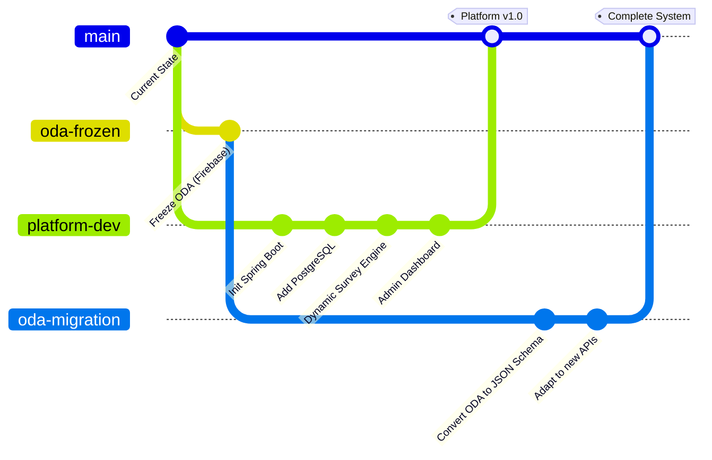

# Development & Integration Strategy
## Parallel Development of ODA and Survey Platform

**Date:** 2026-01-13  
**Status:** PROPOSED

---

## 1. The Challenge

We need to:
1. **Keep ODA functional** (current production system)
2. **Build the new platform** (backend + dynamic frontend)
3. **Integrate ODA as Survey #1** (at the end)

---

## 2. Recommended Branching Strategy



---

## 3. Branch Breakdown

### Branch: `oda-frozen` (Archive)
**Purpose:** Preserve the current ODA implementation exactly as-is.

**What to do:**
```bash
# Create from current main
git checkout main
git checkout -b oda-frozen
git push -u origin oda-frozen
```

**Rules:**
- ❌ No new features
- ✅ Only critical bugfixes (if needed during platform dev)
- This is your "rollback safety net"

---

### Branch: `platform-dev` (Active Development)
**Purpose:** Build the new survey platform from scratch.

**What to do:**
```bash
# Start fresh from main
git checkout main
git checkout -b platform-dev
```

**Tech Stack:** Spring Boot + PostgreSQL + Angular (refactored)

**Key Differences from ODA:**
- No Firebase dependencies
- Backend is Java (not just Angular)
- Frontend is a "generic survey runner" (not ODA-specific)

**Development Timeline:**
- Weeks 1-6: Build core platform (auth, CRUD, dynamic rendering)
- Week 7: Test with a simple sample survey (not ODA)
- Week 8: Prepare for ODA integration

---

### Branch: `oda-migration` (Integration Phase)
**Purpose:** Adapt ODA to work within the new platform.

**When to create:** After `platform-dev` is stable (Week 7+)

**What to do:**
```bash
# Branch from the frozen ODA code
git checkout oda-frozen
git checkout -b oda-migration
```

**Migration Tasks:**
1. Extract ODA questions from Firebase → Convert to PostgreSQL JSON schema
2. Replace `AssessmentService` calls from Firebase to Spring Boot APIs
3. Update `ResultsComponent` to fetch from `/api/responses/{uuid}`
4. Test ODA end-to-end in the new system

---

## 4. Project Structure (Platform-Dev Branch)

Since you're building a **new system**, here's the recommended structure:

```
open-data-assessment-project/  (rename to 'survey-platform')
├── backend/                    (NEW - Spring Boot)
│   ├── src/main/java/
│   │   └── com/yourorg/survey/
│   │       ├── controller/
│   │       ├── service/
│   │       ├── repository/
│   │       └── entity/
│   ├── src/main/resources/
│   │   └── application.yml
│   └── pom.xml
│
├── frontend/                   (REFACTORED Angular)
│   ├── src/app/
│   │   ├── admin/             (NEW - Survey Builder)
│   │   ├── runner/            (NEW - Dynamic Survey Runner)
│   │   └── shared/            (Reusable components)
│   └── angular.json
│
├── docker-compose.yml          (NEW - Postgres + Backend + Frontend)
└── README.md
```

**Key Point:** You're **not modifying** the ODA code yet. You're building a parallel system.

---

## 5. Workflow Timeline

### Weeks 1-6: Build Platform (`platform-dev`)
```bash
# You are here
git checkout platform-dev

# Daily work
git add .
git commit -m "Add Survey CRUD endpoints"
git push origin platform-dev
```

**ODA Status:** Still running on `main` or `oda-frozen` (Firebase version)

---

### Week 7: Create Sample Survey
**Test the platform with something simple** (not ODA):
- Survey Title: "Product Feedback"
- 3 questions: Name (text), Rating (1-5), Comments (textarea)
- Verify: Create → Take → View Results

**If this works → Platform is ready for ODA migration**

---

### Week 8: Integrate ODA (`oda-migration`)
```bash
# Switch to frozen ODA code
git checkout oda-frozen
git checkout -b oda-migration

# Make changes to adapt ODA to the new APIs
# (Keep commits small and focused)

# When done
git checkout platform-dev
git merge oda-migration  # Integrate ODA as Survey #1
```

---

## 6. Integration Checklist

When merging ODA into the platform:

**Backend:**
- [ ] Seed PostgreSQL with ODA schema (Survey ID = 1)
- [ ] Configure AI prompt for ODA

**Frontend:**
- [ ] Route `/assessment` → redirects to `/survey/1`
- [ ] Keep `ResultsComponent` but update data source
- [ ] Test theme calculations still work

**Testing:**
- [ ] Take ODA assessment end-to-end
- [ ] Verify AI recommendations generate
- [ ] Compare results with old Firebase version

---

## 7. Deployment Strategy

### Option A: Big Bang (Recommended for Internal Use)
- Build platform completely
- Migrate ODA in one release
- Switch DNS/hosting in one go

### Option B: Gradual (If you want to be cautious)
- Deploy platform to `beta.yoursite.com`
- Run ODA on both systems in parallel
- Compare results for a week
- Then switch

---

## 8. Addressing Your Specific Question

> "Keep ODA in a separate branch and start implementation of the new project in a completely new branch"

**Answer:** ✅ **Yes, this is the right approach.**

**Action Plan:**
1. **Today:** Create `oda-frozen` branch (your backup)
2. **Today:** Create `platform-dev` branch (your workspace)
3. **Weeks 1-6:** Build platform in `platform-dev` (ignore ODA)
4. **Week 7:** Test platform with a simple survey
5. **Week 8:** Create `oda-migration` branch and adapt ODA
6. **Week 9:** Merge everything to `main` and deploy

---

## 9. Benefits of This Approach

✅ **ODA stays untouched** (you can always rollback)  
✅ **Clean development** (no confusion between old/new code)  
✅ **Testable** (platform works standalone before ODA integration)  
✅ **Clear milestones** (each branch has a specific purpose)

---

## 10. Commands Summary

```bash
# Step 1: Freeze current ODA
git checkout main
git checkout -b oda-frozen
git push -u origin oda-frozen

# Step 2: Start platform development
git checkout main
git checkout -b platform-dev
# (initialize Spring Boot project here)
git add .
git commit -m "Initialize Survey Platform"
git push -u origin platform-dev

# Step 3 (Later): Migrate ODA
git checkout oda-frozen
git checkout -b oda-migration
# (make ODA adaptations here)

# Step 4: Merge everything
git checkout platform-dev
git merge oda-migration
git checkout main
git merge platform-dev
```

---

**Ready to proceed?** Let me know if you want me to:
1. Create the initial Spring Boot project structure
2. Help you set up the branches
3. Start with the backend or frontend first
