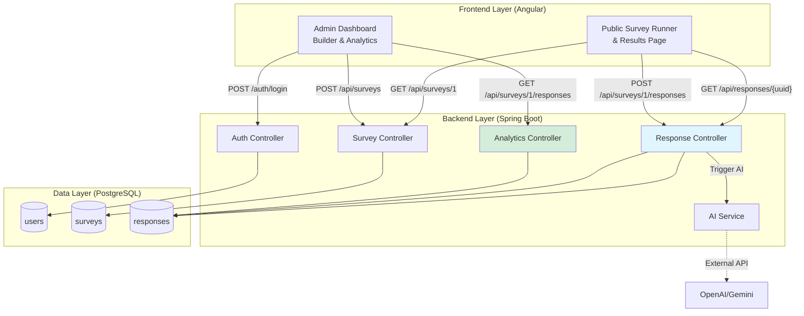
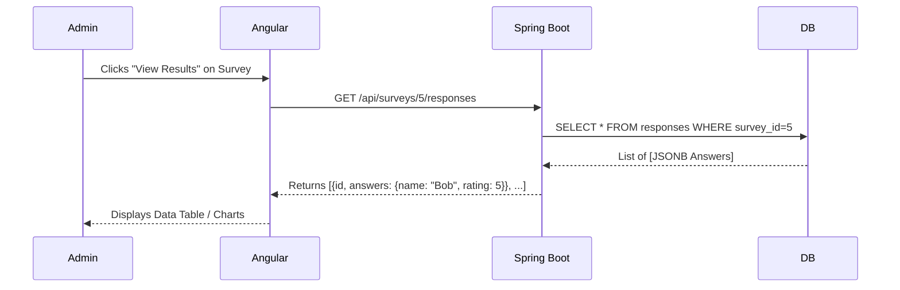
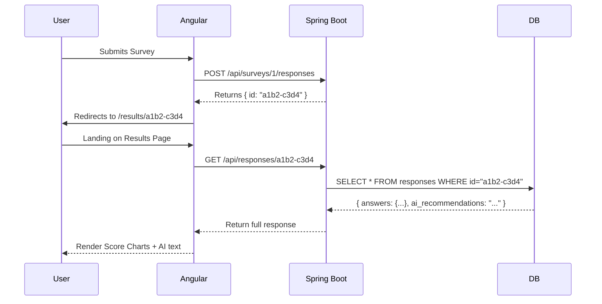

# Dynamic Survey Platform Proposal
## Transform "Open Data Assessment" into an Enterprise Survey Engine

**Date:** 2026-01-12  
**Version:** 2.2 (Syntax Fix)  
**Status:** APPROVED REQUIREMENTS

---

## 1. Executive Summary

Transform the current "Open Data Assessment" into a **multi-admin survey platform** with dynamic survey creation, configurable AI recommendations, and complete backend/frontend separation. The platform will initially serve internal use with architecture designed to scale into a public SaaS offering.

### Key Requirements (Confirmed)
✅ **Internal use** with future SaaS expansion  
✅ **Multi-admin access** (multiple users can create surveys)  
✅ **Configurable AI** per survey (with disable option)  
✅ **ODA migrates** as Survey #1  
✅ **Open source** backend (PostgreSQL + Spring Boot)
✅ **Response Viewing** for both Admins (Analytics) and Users (Results)

---

## 2. Tech Stack

| Component      | Technology              | Reasoning                                                              |
| -------------- | ----------------------- | ---------------------------------------------------------------------- |
| **Frontend**   | Angular 19+             | Current stack. Excellent for complex forms and dynamic rendering.      |
| **Backend**    | Java Spring Boot        | Enterprise-grade, type-safe, massive ecosystem (Spring Security, JPA). |
| **Database**   | PostgreSQL 16+          | Open source RDBMS with JSONB for dynamic schemas.                      |
| **Auth**       | Spring Security + JWT   | Secure multi-admin authentication.                                     |
| **AI**         | OpenAI API / Gemini API | Configurable per survey via stored prompts.                            |
| **Deployment** | Docker + Docker Compose | Portability for future SaaS deployment.                                |

---

## 3. Architecture Overview



---

## 4. Database Schema

### Table 1: `users` (Multi-Admin Support)
```sql
CREATE TABLE users (
    id BIGSERIAL PRIMARY KEY,
    email VARCHAR(255) UNIQUE NOT NULL,
    password_hash VARCHAR(255) NOT NULL,
    full_name VARCHAR(255),
    role VARCHAR(50) DEFAULT 'ADMIN', 
    created_at TIMESTAMP DEFAULT NOW()
);
```

### Table 2: `surveys` (Dynamic Structure + AI Config)
```sql
CREATE TABLE surveys (
    id BIGSERIAL PRIMARY KEY,
    title VARCHAR(500) NOT NULL,
    description TEXT,
    creator_id BIGINT REFERENCES users(id),
    
    -- Dynamic survey structure
    schema JSONB NOT NULL,
    
    -- AI Configuration
    ai_enabled BOOLEAN DEFAULT false,
    ai_prompt_template TEXT,
    ai_context TEXT,
    
    is_active BOOLEAN DEFAULT true,
    created_at TIMESTAMP DEFAULT NOW()
);
```

### Table 3: `responses`
```sql
CREATE TABLE responses (
    id UUID PRIMARY KEY DEFAULT gen_random_uuid(),
    survey_id BIGINT REFERENCES surveys(id),
    
    -- User answers (dynamic)
    answers JSONB NOT NULL,
    
    -- AI-generated recommendations (if enabled)
    ai_recommendations TEXT,
    
    submitted_at TIMESTAMP DEFAULT NOW()
);
```

---

## 5. Core Workflows

### Workflow 1: Admin Creates a Survey
*(Standard CRUD flow: Create JSON schema -> Save to DB)*

### Workflow 2: User Takes Survey (ODA Example)
*(User fetches ID=1 -> Renders Form -> Submits -> Gets UUID)*

### Workflow 3: Admin Views Responses (Analytics)
**Scenario:** Admin wants to see who took the "Employee Satisfaction" survey.



### Workflow 4: User Views *Their* Result (Important for ODA)
**Scenario:** User finishes assessment and sees their score + AI insights.



---

## 6. API Endpoints for Data Retrieval

| Role      | Method | Endpoint                      | Description                                                                                       |
| --------- | ------ | ----------------------------- | ------------------------------------------------------------------------------------------------- |
| **Admin** | `GET`  | `/api/surveys/{id}/responses` | **Bulk Fetch.** Returns all responses for a survey. Used for the Admin Data Table.                |
| **Admin** | `GET`  | `/api/surveys/{id}/stats`     | **Aggregates.** Returns summary stats (e.g. "Avg Rating = 4.2"). Used for Admin Dashboard charts. |
| **User**  | `GET`  | `/api/responses/{uuid}`       | **Single Fetch.** Returns one specific response. Used for the "Thank you / Results" page.         |

---

## 7. Migration Plan: ODA → Survey #1

### Phase 1: Data Migration Script
*(Extract Firebase -> Seed PostgreSQL)*

### Phase 2: Route Mapping
**Old:** `yoursite.com/assessment`  
**New:** `yoursite.com/survey/1`

### Phase 3: Results Page Support
The existing ODA "Results Page" is complex (charts, detailed breakdown). 
*   **Strategy:** We will keep the `ResultsComponent` in Angular.
*   **Change:** Instead of reading from LocalStorage or Firebase, it will simply call `GET /api/responses/{uuid}` to get the data it needs to render.

---

## 8. Implementation Roadmap

### Phase 1: Foundation (Weeks 1-2)
- [x] Requirements gathering
- [ ] Initialize Spring Boot + Postgres
- [ ] Implement Auth & Survey CRUD

### Phase 2: Core Engine & **Response Viewing** (Weeks 3-4)
- [ ] Build `DynamicSurveyComponent` (Runner)
- [ ] Build **`ResultsController`** (API for getting answers)
- [ ] Build Admin Data Table (Angular Material / AG Grid)

### Phase 3: AI Integration (Week 5)
- [ ] AI Service implementation

### Phase 4: ODA Migration (Week 6)
- [ ] Migrate Data
- [ ] Adapt `ResultsComponent` to use new API

---

## 9. Summary

This design now explicitly handles the "loop back" of data:
1.  **Admins** have a dashboard to view/export all data for any survey.
2.  **Users** get a persistent link to their specific result (crucial for sharing assessment scores).

**Next Steps:**
1. Approve this proposal
2. Set up development environment (Spring Boot + Postgres)
3. Start Phase 1 implementation
