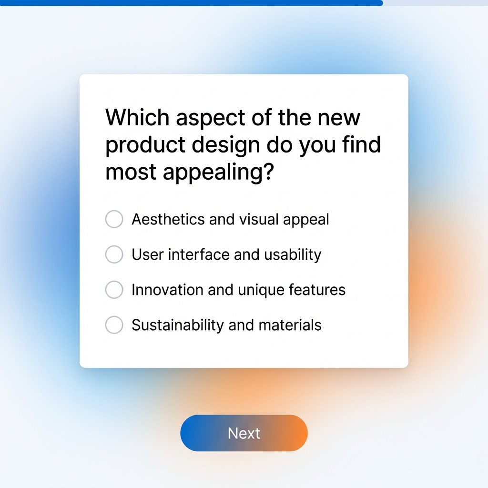
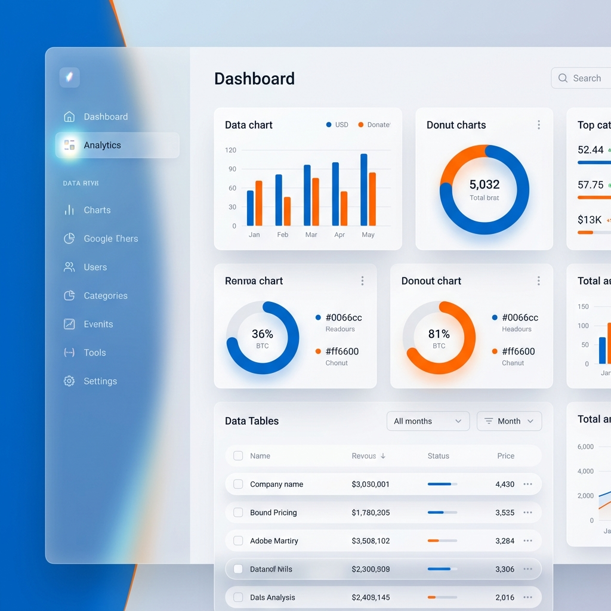

# Survey Platform UI Style Guide (V2 - Modern)

> **Design Philosophy:** "Premium, Fluid, & Intelligent".
> We move away from basic "blocks" to a floating, layered UI with glassmorphism, soft shadows, and dynamic micro-interactions. The colors remain NashTech (Blue/Orange) but applied with gradients and subtler opacities.

## Visual Reference (Mockups)

### 1. Admin Dashboard ("Command Center")
Glassmorphism sidebar, floating cards with sparklines, and a clean, airy layout.


### 2. Survey Builder ("Infinite Canvas")
Floating toolbars, infinite dot-grid canvas, and glass overlay panels for properties.


### 3. Survey Taker View ("Focus Mode")
Minimalist, center-focused card with a subtle gradient background to reduce distractions.


### 4. Analytics Dashboard ("Data Intelligence")
Rich data visualization with floating chart cards and a sleek data table.


---

## 1. The Modern Foundation

### Colors (Refined)
We keep the core brand but add **tints** for modern backgrounds.

| Token | Value | Usage |
| :--- | :--- | :--- |
| **Primary** | `#0066cc` | core actions |
| **Primary Soft** | `#e6f0ff` | subtle backgrounds, active list items |
| **Secondary** | `#ff6600` | highlights, call-to-actions |
| **Gradient** | `linear-gradient(135deg, #0066cc 0%, #ff6600 100%)` | Branding headers, primary buttons |
| **Surface** | `#ffffff` | Card backgrounds |
| **Background** | `#f8f9fc` | Main app background (slightly cool gray) |
| **Glass** | `rgba(255, 255, 255, 0.8)` | Sticky headers, floating panels |

### Depth & Shape
Instead of flat borders, we use **elevation**.

*   **Cards:** 
    *   Radius: `16px` (More rounded = friendlier/modern)
    *   Shadow: `0 10px 30px -10px rgba(0,0,0,0.08)` (Soft, diffused glow)
    *   Border: `1px solid rgba(0,0,0,0.03)` (Barely visible stroke)
*   **Floating Elements (Modals/Popovers):**
    *   Shadow: `0 20px 40px -10px rgba(0,0,0,0.15)`
    *   Effect: `backdrop-filter: blur(12px)` (Glassmorphism)

### Typography
*   **Headings:** `Inter`, Weight 700. Dark Slate (`#1a202c`). Tight tracking (`-0.02em`).
*   **Body:** `Inter`, Weight 400. Cool Gray (`#4a5568`). Relaxed line-height (`1.6`).

### Iconography
*   **Style:** Modern **Outline** icons (e.g., Heroicons or Phosphor Icons). 
*   **Stroke:** 1.5px or 2px. 
*   **Usage:** Icons should be paired with text in navigation, or standalone in circular action buttons.

---

## 2. Component Design

### Buttons
*   **Primary:** Full Gradient background. Rounded `50px` (Pill shape) or `12px`.
    *   *Hover:* Slight lift (`transform: translateY(-2px)`), shadow increases.
*   **Secondary:** White background, Primary Color border.
*   **Icon Button:** Circular, transparent background (Ghost). Hover turns it `Primary Soft`.

### Input Fields (Modern SaaS Style)
*   **Default:** Light gray background (`#f1f5f9`), no border. internal padding `12px 16px`. Rounded `12px`.
*   **Focus:** Background turns White, Blue Border appears (animated), shadow ring.
*   **Label:** Small, bold, uppercase above the input? Or Floating Label? -> *Decision: Labels outside, bold and dark.*

### Navigation (Sidebar)
*   Instead of a solid dark block, use a **Glass Sidebar**.
*   **Active Link:** `Primary Soft` background + Primary Blue text + Vertical pill indicator on the left.
*   **Hover:** Background fades in.

---

## 3. Screen Revamps

### A. Admin Dashboard (The "Command Center")
**Old:** Grid of simple cards.
**New:**
*   **Hero Section:** "Welcome back, Admin". clean white text on a curved Gradient background.
*   **Stats Row:** 4 Cards. Not just numbers, but **Sparklines** (mini charts) in the background.
    *   "Total Responses" | "Completion Rate" | "Avg Time"
*   **Recent Surveys:** A "Table" but styled as a list of floating cards.
    *   Status Badges: Pill shape, low opacity background (e.g. Green text on Light Green bg).

### B. Survey Builder (The "Canvas")
**Old:** 3 rigid columns (Tools | Canvas | Properties).
**New:** "Infinite Canvas" feel.
*   **Canvas:** Dot-grid pattern background (`#f8f9fc`).
*   **Toolbox (Left):** A **Floating** narrow pill-shaped dock. Icons only (with tooltips) to save space.
*   **Properties (Right):** A **Slide-over glass panel**. It only appears when an element is clicked.
*   **The Survey Page:** Looks like a real sheet of paper (White, Shadow) sitting on the desk (Canvas).

### C. Survey Taker View (The "Experience")
**Old:** Standard form.
**New:** "Focus Mode".
*   **Background:** Full screen subtle animated gradient.
*   **Card:** One central "Card" that holds the current question.
*   **Transitions:** When clicking Next, the current card slides left and fades out; new one slides in. **Smooth motion is key.**
*   **Progress:** A thin line at the very top, or a circular progress ring in the corner.

---

## 4. Micro-Interactions (The "Wow" Factor)
These small details make the app feel "Pro".

1.  **Hover:** Cards should subtly lift up.
2.  **Click:** Buttons should have a "ripple" effect.
3.  **Loading:** No spinners! Use **Skeleton Screens** (shimmering gray shapes) for content.
4.  **Success:** When saving a survey, show a Toast notification that slides in from the bottom-center with a checkmark animation.

---

## 5. Implementation Notes
*   **CSS Framework:** Tailwind CSS (recommended) or custom SCSS.
*   **Animation:** Framer Motion (if React) or Anime.js / CSS Transitions.
*   **Glass Effect:**
    ```css
    .glass-panel {
        background: rgba(255, 255, 255, 0.7);
        backdrop-filter: blur(10px);
        border: 1px solid rgba(255, 255, 255, 0.3);
    }
    ```
